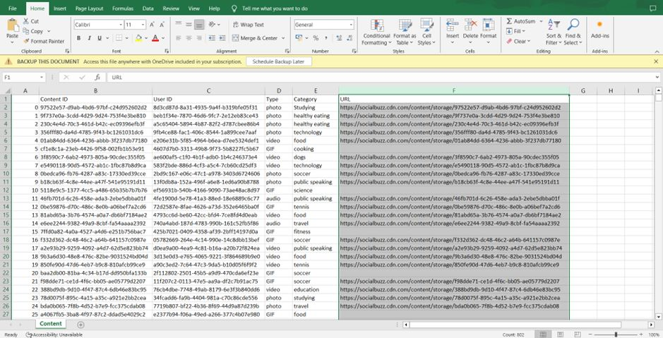

# Accenture-Social-Buzz-Analysis-Using-Excel
<b></b>

This project is part of Accenture's virtual job simulation

# Table of Contents
1. [Introduction](#introduction)
2. [Task 1: Project Understanding](#task-1-project-understanding)
    * [Tasks to be delegated](#tasks-to-be-delegated)
    * [Task assigned to me as a data analyst](#task-assigned-to-me-as-a-data-analyst)
3. [Task 2:  Data Cleaning & Modelling](#task-2--data-cleaning--modelling)
    * [Let's dive into the data](#lets-dive-into-the-data)
    * [Requirements Gathering](#requirements-gathering)
    * [Data Cleaning](#data-cleaning)
    * [Data Modelling](#data-modelling)
    * [Identifying the top 5 categories](#identifying-the-top-5-categories)
4. [Additional Analysis](#additional-analysis)
5. [To Summarize](#to-summarize)
<b></b>
# Introduction

+ Client: **Social Buzz**
+ Problem Statement: **Identifying the top 5 daily categories** of content uploaded on their website.

# Task 1: Project Understanding

Client background: Social Buzz was founded by two former engineers from a large social media conglomerate, one from London and the other from San Francisco. They left in 2008 and both met in San Francisco to start their business. They started Social Buzz because they saw an opportunity to build on the foundation that their previous company started by creating a new platform where content took centre stage. Social Buzz emphasizes content by keeping all users anonymous, only tracking user reactions to every piece of content. There are over 100 ways that users can react to content, spanning beyond the traditional reactions of likes, dislikes, and comments. This ensures that trending content, as opposed to individual users, is at the forefront of user feeds. 
Over the past 5 years, Social Buzz has reached over 500 million active users each month. They have scaled quicker than anticipated and need the help of an advisory firm to oversee their scaling process effectively. 
Due to the rapid growth and digital nature of their core product, the amount of data they create, collect and must analyze is huge. Every day over 100,000 pieces of content, ranging from text, images, videos and GIFs are posted. All of this data is highly unstructured and requires extremely sophisticated and expensive technology to manage and maintain. Out of the 250 people working at Social Buzz, 200 of them are technical staff working on maintaining this highly complex technology. Up until this point, they have not relied on any third-party firms to help them get to where they are. However, there are 3 main reasons why they are now looking at bringing in external expertise: 
1) They are looking to complete an IPO by the end of next year and need guidance to ensure that this goes smoothly. 
2) They are still a small company and do not have the resources to manage the scale that they are currently at. They could hire more people, but they want an experienced practice to help instead. 
3) They want to learn data best practices from a large corporation. Due to the nature of their business, they have a massive amount of data so they are keen on understanding how the world's biggest companies manage the challenges of big data.
To start our engagement with Social Buzz, we are running a 3-month initial project in order to prove to them that we are the best firm to work with. They are expecting the following:
+ An audit of their big data practice
+ Recommendations for a successful IPO
+ An analysis of their content categories that highlight the top 5 categories with the largest aggregate popularity

## Tasks to be delegated: 
+ Creation of an up-to-date big data best practices presentation
+ Extraction of sample data sets using SQL - On-site audit of their data centre - Merging of sample data set tables 
+ Virtual session with Social Buzz team to present previous client success stories relevant to them 
+ Preparation of best practice document for IPO
+ Loading of sample data sets into Accenture sandbox database 
+ Technology architecture workshop with Social Buzz Data Team to understand their technology landscape
+ Stress testing of their technology to identify weak spots
+ Communication with previous IPO companies within our client base for reference stories
+ Analysis of sample data sets with visualizations
+ Full documentation of the process that we can guide them through for IPO

## Task assigned to me as a data analyst:

Analysis of sample data sets with visualizations to understand the popularity of different content categories.

# Task 2:  Data Cleaning & Modelling

+ Identify which datasets will be required to answer the client’s business question
+ Clean the datasets and merge them to prepare the data for analysis
+ Determine the answer to the client’s business question

## Let's dive into the data
Now you have a good understanding of the project and your role.
 
So, let’s have a look at what data you have to work with. The client has sent through:

+ **7 data sets** - each data set contains different columns and values
+ **A data model** - this shows the relationships between all of the data sets, as well as any links that you can use to merge tables.
There is a lot of information here and it’s easy to get lost in the data. So, to make sure we are using the right data to answer the business questions you’ll follow these steps:
1.	Requirements gathering
2.	Data cleaning
3.	Data modelling

## Requirements Gathering

We have been sent **7** datasets and a data model.

So, the first step is to use this data model to identify which datasets will be required to answer your business question - which is to figure out the _top 5 categories_ with the largest popularity.
1.	User ID
2.	Profile User ID
3.	Location User ID
4.	Session User ID
5.	Content ID
6.	Reaction Content ID
7.	ReactionTypes Type

**Reaction Content ID**, **Content ID**, **Reaction Content ID**. Because my job is to identify which content categories are most popular. Popularity is determined based on reaction scores.

## Data Cleaning
Data cleaning is a common and very important task when working with data.

1.	Cleaning Contents.csv file

There are 6 columns in this dataset.
+	We don’t need the _"URL column"_ because it doesn’t provide any quantitative measure for the top 5 categories. Therefore, we will delete it.
+	For the same reason we will also delete the _"User id"_ column.
+ Next, let's check the _"Category"_ column

<b>
</b>

+ The "Category column" needs to be cleaned as it contains the same data in upper case and lower case.

One way of doing this in Excel is by using the "find and replace toolbox". You can manually go to the home ribbon and select find and replace under the editing section or press “ctrl + F” to open the find and replace dialogue box.

Under the “find what section”, enter " symbol, and then hit "replace all" to clean the category column.

+ Change the column name "type" to "content type" to make the data more consistent.

Now this dataset is cleaned, let’s check Reactions.xlsx.
<b></b>

2.	Reactions.csv

+ This dataset contains _7_ columns. Let’s do some data checking and see if we can find any missing values. We can select the whole data and apply the filter function to see if there are any blank values.

The "User id" and "Type" columns contain blank values. The type column is important for our analysis.

+ To remove them we can select the "Type" column and apply the filter function to select the blank value and then delete them from our dataset.

To delete, select the (Blanks) row, after selecting them hit the delete button on your keyboard or left-click on your mouse while selecting any cell in the data and select the “delete row” option.

+ Also let’s delete the “User Id” column and the "first" column from all the datasets as they have no use in your analysis.
<b></b>

3.	ReactionTypes.csv

This dataset does not contain any missing values.

## Data Modelling

+ Create a final data set by merging our three cleaned datastes together.
+ Figure out the Top 5 performing categories

We will keep the Reaction.xlsx as our base file. Then we will merge the data from the other two datasets in this Reactions.xlsx file. One way to do that is:
+ Open all the datasets.
+ Reactions.csv is our base file as it is mentioned in the task.
+ Let’s merge data from the Contents.cvs first. We want to merge the content type and category column to our Reactions.csv file. We will use Vlookup formula to do that.
+ In our Reactions.csv file first create a column called "Content Type" and select the first cell in that column. Then apply the Vlookup formula.

+ Then apply autofill to populate the remaining cells in the "Content Type" column.
+ Again, use the Vlookup formula to merge the "Category" column in the "Reactions.csv" file.

+ We have successfully merged the data from "Contents.csv" to the "Reaction.csv".

+ Now, let’s merge data from **ReactionTypes.csv**
+ First create two columns in the Reactions.csv called "Sentiment" and "Reaction_Score". Then apply the VLookup formula to merge the data from ReactionTypes.csv to Reactions.csv. We will use the value from the Reaction Type column as the lookup value in the Vlookup formula.

+ We have successfully merged the data.
+ Now, save the Reaction.csv file into excel workbook format.
+ After doing that open the new Reaction.xlsx

## Identifying the top 5 categories

Now that we have the data which is required to do our analysis, let’s identify the top 5 categories.

+ First, create a new sheet in the “Reactions workbook”, called “Aggregated Score”.
+ Copy the values from the Category column, hover over the paste section and select the second option.

+ Do this step for all the merged columns so that there will be no errors if you want to copy these merged values in other sheets.
+ Then copy the values from the "Category" column in the "Reactions" sheet to the "Aggregated Score".
+ After copying that click on the “Remove Duplicates” option in the Data tools section in the Data ribbon, to get the original **16 categories**.

+ Create a "Score" column to get the aggregate score of all the categories by using the SUMIF formula.

+ Then we will just Autofill the remaining cells to populate them.
+ Again, copy the "Score" column and paste it by selecting the 2nd column in the pate section.

+ Sort the values in the descending order to get the top 5 categories. 
+ Create a new sheet called the “Top 5 Categories” and paste only the first 6 cells from the “Aggregated Score” sheet.

There we have it; we have successfully identified the top 5 Content categories in our client’s website.

# Additional Analysis 
+ Let’s dive into the popularity percentage share of each category.

The **“animal”** category has a **21.4%** percentage share of popularity followed by the **“science”** category with **20.3%**.

Let’s find the month with the greatest number of posts.

We can see the that month where most posts were posted is **May, (2,138 posts)**. 

# To Summarize

+ There are **16** unique categories.
+ The **top 5 categories** based on content popularity are **Animals, Science, Healthy Eating, Technology and Food**, respectively.
+ **Popularity shares** of the top 5 contents are **21.4%, 20.3%, 19.8%, 19.6%, 19%, respectively**.
+ **May** was the month that had the **most number of posts, 2,138 posts**.

